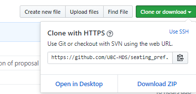

# CONTRIBUTING


### How to contribute

 To contribute to the project do not work in the master repository. Changes can be made to the master repository through pull requests from either a fork or a branch. When you want to submit new work that you developed, you must push all your changes to your fork or branch. Then, please send a `pull request`.

 Another team member will review the pull request and accept the request. For more important pull requests more than one team member should review the work before accepting the request.

At this time, contributions are only accepted by team members. If you find any bugs and you would want us to solve them, kindly open an "Issue" on this Github respository.

#### How to fork?
Go to the main repository [here](https://github.com/UBC-MDS/seating_pref).

On the right top corner, click on the `Fork` button.


Go to your forked version of this repository.
Clone that repository using the commands:

```
git clone
```
And add your sash key.
You can find this key under the Green Clone or Download button:


Once you cloned your repository, set up the original repository as the upstream master. Do this from the terminal using the following commands:

```
git remote add upstream https://github.com/UBC-MDS/seating_pref.git

git fetch upstream
git merge upstream/master
```

Whenever you want to update your own forked repository from the master repository, use the last two commands together, they work like a `git pull` and save it to your local computer.

If you want to update your forked version, use `git push` to send the new changes from your local computer to your forked GitHub repository.


#### How to branch?
Here are instructions for how to create and delete branches https://help.github.com/en/articles/creating-and-deleting-branches-within-your-repository

#### Raising Issues
The team will use issues to track tasks for each milestone. Feedback on the project will be posted as issues.

If a member of the public notices a bug or has a question, please post an issue.

#### Commit Messages
Commit messages help us know what was done. Keep them simple and meaningful.

#### Directory Structure
Keep the repository organized and clean. Place files in appropriate folders and only have key items in root folder.

## Agreement
By contributing to this project you agree to the [code of conduct](CONDUCT.md).

## Attribution

This Code of Conduct is adapted from the Contributor Covenant, version 1.0.0, available at https://www.contributor-covenant.org/version/1/0/0/code-of-conduct.html
