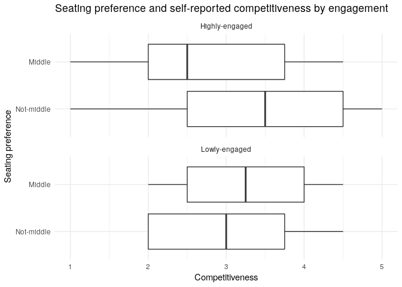

Investigate: Competitiveness and seating preference
================

Investigators: Ayla Pearson, Bonnie Zhang, George Wu, Socorro Dominguez

Date: April 6th, 2019

The current analysis seeks to explore the relationship between
`self-reported competitiveness` and `seating preference` in a classroom.
We also want to determine whether this relationship is confounded by an
individual’s `gender` or `enagement` level. Toward this goal, we
constructed a
[survey](https://ubc.ca1.qualtrics.com/jfe/form/SV_d1ex7dheBUxPGPb), and
collected responses from individuals affiliated with the Master of Data
Science program at the University of British Columbia.

## Data ingestion

We compiled the seating preference, self-reported competitiveness,
gender, as well as engagement information from 64 survey entries. A full
description of the dataset and ingestion procedures can be found
[here](https://github.ubc.ca/sedv8808/seat_pref_survey).

``` r
# load libraries
suppressPackageStartupMessages(library(tidyverse))
suppressPackageStartupMessages(library(gridExtra))
library(apaTables)
```

``` r
# load data
df <- read_csv("../seat_tidy.csv")

# convert categorical variables to factors
df <- df %>% 
  mutate_at(c("seat_pref", "gender"), factor)

# preview data
df %>% head()
```

    ## # A tibble: 6 x 4
    ##   seat_pref  comp gender engage
    ##   <fct>     <dbl> <fct>   <dbl>
    ## 1 1           2   1        2   
    ## 2 2           3.5 2        2.33
    ## 3 2           3   2        3.33
    ## 4 2           4   1        3.67
    ## 5 2           4.5 1        3   
    ## 6 4           1   2        3

Note that the column `seat-pref` corresponds to seating preference,
`comp` corresponds to self-reported competitiveness, `gender`
corresponds to gender, and `engage` corresponds to an individual’s
engagement level.

## Data overview

#### Missing data

We offered the option for participants not to respond to certain survey
questions. We will simply consider these omitted responses as missing
values.

``` r
# re-encode "prefer not to response" (level 4) as missing data
df$seat_pref <- df$seat_pref %>% 
  fct_recode("Front" = "1", 
             "Middle" = "2", 
             "Back" = "3",  
             NULL = "4")

df$gender <- df$gender %>% 
  fct_recode("Man" = "1",
             "Woman" = "2",
             NULL = "4")

# evaluate missing data
df %>% summary()
```

    ##   seat_pref       comp         gender       engage     
    ##  Front :20   Min.   :1.000   Man  :34   Min.   :1.667  
    ##  Middle:28   1st Qu.:2.000   Woman:25   1st Qu.:3.000  
    ##  Back  :12   Median :3.000   NA's : 5   Median :3.667  
    ##  NA's  : 4   Mean   :3.047              Mean   :3.661  
    ##              3rd Qu.:4.000              3rd Qu.:4.333  
    ##              Max.   :5.000              Max.   :5.000  
    ##                                         NA's   :1

We are missing 4 entries for `seating preference`, 5 entries for
`gender`, as well as 1 entry for `engagement`. As we do not have enough
information to meaningfully impute these missing values, we will simply
drop these missing records from the dataset.

Note also that there were no participants that identified with genders
other than man or woman.

``` r
# drop missing data
df <- df %>% drop_na()
df %>% dim()
```

    ## [1] 56  4

We have 56 remaining records after removing the missing information.

#### Variable scaling

Both continuous variables, `comp` and `engage`, were measured using a
5-point Likert scale, as such, there should be no scaling issues for
these two variables.

#### Multicollinearity

We want to make sure that the two continuous variables, namely the
competitiveness variable (`comp`) and the engagement variable
(`engage`), are not measuring the same psychological construct. For this
reason, we will examine the Pearson correlation coefficient between
these two variables.

``` r
# evaluate correlation between comp and engage
# note that for EDA, we are not calculating the p-value for this coefficient
cor(x = df$comp, y = df$engage, method = "pearson")
```

    ## [1] 0.2106774

It appears that self-reported competitiveness is rather weakly and
positively associated with engagement level. This association is weak
enough that we needn’t worry too much about multicollinearity issues for
this dataset. They seem to be indeed measuring different constructs.

## Univariate analysis

Let’s take a closer look at each variable individually. Specifically,
let’s visualize the distribution of each variable.

#### Visual univariate analysis

``` r
# visualize seating preference
g31 <- df %>%   
  ggplot(aes(x = seat_pref)) +
  geom_bar() +
  theme_minimal() +
  xlab("Seating preference") +
  ylab("Number of people")

# visualize competitiveness
g32 <- df %>% 
  ggplot(aes(x = comp)) +
  geom_histogram(bins = 5, binwidth = 1) +
  theme_minimal() +
  xlab("Self-reported competitiveness") +
  ylab("Number of people")

# visualize gender
g33 <- df %>%   
  ggplot(aes(x = gender)) +
  geom_bar() +
  theme_minimal() +
  xlab("Gender") +
  ylab("Number of people")

# visualize engagement
g34 <- df %>% 
  ggplot(aes(x = engage)) +
  geom_histogram(binwidth = 1) +
  theme_minimal() +
  xlab("Engagement") +
  ylab("Number of people")

# display distribution of each variable
grid.arrange(g31, g32, g33, g34)
```

<!-- -->

#### Numerical univariate analysis

We can also examine each variable numerically.

``` r
# obtain descriptive statistics of each variable
df %>% summary()
```

    ##   seat_pref       comp         gender       engage     
    ##  Front :18   Min.   :1.000   Man  :33   Min.   :1.667  
    ##  Middle:26   1st Qu.:2.000   Woman:23   1st Qu.:3.250  
    ##  Back  :12   Median :3.000              Median :3.667  
    ##              Mean   :3.161              Mean   :3.702  
    ##              3rd Qu.:4.000              3rd Qu.:4.333  
    ##              Max.   :5.000              Max.   :5.000

Both visual and numeric examinations of each variable has led to the
following observations:

Many participants prefer to sit in the middle of the classroom (n = 26),
and fewer participants prefer sitting in the front (n = 18), or in the
back (n = 12). Note that the number of participants in each response
level is somewhat unbalanced.

The distribution of self-reported competitiveness is largely normal with
a mean of 3. There are very few (less than five) participants with a
score of 1 or with a score of 5.

There are slightly more self-identified men (n = 33) than
self-identified women (n = 23) being included in the current analysis.
The number of each gender is very roughly balanced (not terribly
unbalanced).

The distribution of engagement level is slightly left-skewed with a mean
of about 3.7. There are no participants associated with a score below 1.
We believe the skewness of this distribution does not warrant major data
transformations.

#### Transformation: seating preference as a binary variable

To address the unbalanced nature of the `seat_pref` variable, it might
be helpful to further consolidate the levels of seating preference.
Specifically, we will bin the levels of `Front` and `Back` to a new
level called `Not-middle`. This new binary seating preference variable
will be used along side our original `seat_pref` for additional
comparisons.

``` r
# bin front/back to a new level "not-middle"
df$seat_pref_binary <- df$seat_pref %>% 
  fct_collapse("Not-middle" = c("Front", "Back"))

df %>% 
  group_by(seat_pref_binary) %>% 
  summarise(n = n())
```

    ## # A tibble: 2 x 2
    ##   seat_pref_binary     n
    ##   <fct>            <int>
    ## 1 Not-middle          30
    ## 2 Middle              26

This new binary seating preference variable is now more balanced, with
more than 26 participants in each level.

## Multivariate analysis

Let’s turn our attention to the relationship among the variables. Recall
that we are most interested in the relationship between seating
preference (`seat_pref`) and self-reported competitiveness (`comp`).

#### Seating preference and competitiveness

Let’s visualize the relationship between these two variables.

``` r
# visualize seat_pref and competitiveness
g41 <- df %>% 
  ggplot(aes(x = seat_pref, y = comp)) +
  geom_boxplot() +
  coord_flip() +
  xlab("Seating preference") +
  ylab("Competitiveness") +
  ggtitle("Seating preference and self-reported competitiveness") +
  theme_minimal()

# visualize binary seat_pref and competitiveness
g42 <- df %>% 
  ggplot(aes(x = seat_pref_binary, y = comp)) +
  geom_boxplot() +
  coord_flip() +
  xlab("Seating preference") +
  ylab("Competitiveness") +
  ggtitle("Seating preference (binary) and self-reported competitiveness") +
  theme_minimal()

# display plots
grid.arrange(g41, g42, ncol = 1)
```

<!-- -->

Let’s also examine the relationship between these two variables
numerically.

``` r
# numeric analysis for original seat_pref
df %>% 
  group_by(seat_pref) %>% 
  summarise(n = n(),
            mean_competitiveness = mean(comp),
            sd_competitiveness = sd(comp))
```

    ## # A tibble: 3 x 4
    ##   seat_pref     n mean_competitiveness sd_competitiveness
    ##   <fct>     <int>                <dbl>              <dbl>
    ## 1 Front        18                 3.11              0.979
    ## 2 Middle       26                 3.06              0.983
    ## 3 Back         12                 3.46              1.20

``` r
# numeric analysis for binary seat_pref
df %>% 
  group_by(seat_pref_binary) %>% 
  summarise(n = n(),
            mean_competitiveness = mean(comp),
            sd_competitiveness = sd(comp))
```

    ## # A tibble: 2 x 4
    ##   seat_pref_binary     n mean_competitiveness sd_competitiveness
    ##   <fct>            <int>                <dbl>              <dbl>
    ## 1 Not-middle          30                 3.25              1.06 
    ## 2 Middle              26                 3.06              0.983

Both visual and numeric examinations of these two variable has led to
the following observations:

There are a wide variation of self-reported competitiveness within each
category of seating preference, as suggested by the relatively high
standard deviation (sd) of competitiveness for each category.

A faint pattern seems to be: participants who reported to be more
competitive tend to prefer to sit in either the front or back of the
classroom, whereas participants who reported to be less competitive seem
to prefer to sit in the middle of the classroom. Using the new binary
`seat_pref` can largely reflect this pattern as well.

To simplify downstream analysis, we will replace the original
three-level `seat_pref` variable with our new binary `seat_pref_binary`
variable.

#### Seating preference and competitiveness with gender

``` r
# visualize seat_pref and competitiveness with gender 
df %>% 
  ggplot(aes(y = comp, x = seat_pref_binary)) +
  geom_boxplot() +
  coord_flip() +
  facet_wrap(~gender, ncol = 1) +
  xlab("Seating preference") +
  ylab("Competitiveness") +
  ggtitle("Seating preference and self-reported competitiveness by gender") +
  theme_minimal()
```

<!-- -->

``` r
df %>% 
  group_by(seat_pref_binary, gender) %>% 
  summarise(n = n(),
            mean_competitiveness = mean(comp),
            sd_competitiveness = sd(comp))
```

    ## # A tibble: 4 x 5
    ## # Groups:   seat_pref_binary [2]
    ##   seat_pref_binary gender     n mean_competitiveness sd_competitiveness
    ##   <fct>            <fct>  <int>                <dbl>              <dbl>
    ## 1 Not-middle       Man       20                 3.25              1.13 
    ## 2 Not-middle       Woman     10                 3.25              0.979
    ## 3 Middle           Man       13                 3.08              0.997
    ## 4 Middle           Woman     13                 3.04              1.01

Both visual and numerical examinations suggests that gender does not
seem to greatly influence the relationship between competitiveness and
seating preference. People who rated themselves to be more competitive
tend to prefer not to sit in the middle of the class, for both genders.

#### Seating preference and competitiveness with engagement

To facilitate and further simplify comparisons, we will categorize
participants with either high or low engagement using the median
engagement score.

``` r
# sort median engagement
median_engage = median(df$engage)

# categorize  engagement
df <- df %>% 
  mutate(engage_binary = if_else(engage > median_engage, "Highly-engaged", "Lowly-engaged"))

# convert to factor
df$engage_binary <- factor(df$engage_binary)

df %>%
  group_by(engage_binary) %>% 
  summarise(n = n())
```

    ## # A tibble: 2 x 2
    ##   engage_binary      n
    ##   <fct>          <int>
    ## 1 Highly-engaged    25
    ## 2 Lowly-engaged     31

We can then visualize the engagement along with seating preference and
competitiveness.

``` r
# visualize seat_pref and competitiveness with gender 
df %>% 
  ggplot(aes(y = comp, x = seat_pref_binary)) +
  geom_boxplot() +
  coord_flip() +
  facet_wrap(~engage_binary, ncol = 1) +
  xlab("Seating preference") +
  ylab("Competitiveness") +
  ggtitle("Seating preference and self-reported competitiveness by engagement") +
  theme_minimal()
```

<!-- -->

``` r
df %>% 
  group_by(seat_pref_binary, engage_binary) %>% 
  summarise(n = n(),
            mean_competitiveness = mean(comp),
            sd_competitiveness = sd(comp))
```

    ## # A tibble: 4 x 5
    ## # Groups:   seat_pref_binary [2]
    ##   seat_pref_binary engage_binary      n mean_competitiven… sd_competitiven…
    ##   <fct>            <fct>          <int>              <dbl>            <dbl>
    ## 1 Not-middle       Highly-engaged    15               3.47            1.22 
    ## 2 Not-middle       Lowly-engaged     15               3.03            0.876
    ## 3 Middle           Highly-engaged    10               2.75            1.14 
    ## 4 Middle           Lowly-engaged     16               3.25            0.856

Both visual and numerical examinations suggests that engagement does
somewhat influence the relationship between competitiveness and seating
preference. People who rated themselves to be more competitive tend to
prefer not to sit in the middle of the class, especially they are also
highly-engaged. Interestingly, some competitive participants who are not
typically engaged in the class content, prefer sitting in the middle of
class instead.

## Summary

The current analysis aims to explore the relationship between
self-reported competitiveness and seating preference. We examined the
distribution of each variable in the dataset, as well as the
relationship and potential interactions among these variables, and
transformed the variables as necessary.

Using both visual and numeric examinations, we mainly observed that:

  - Participants who rated themselves to more competitive tend to prefer
    sitting in either the front or back of the classroom, whereas
    participants who rated themselves to less competitive tend to prefer
    sitting in the middle of the classroom.

  - Gender does not seem to influence the relationship between
    self-reported competitiveness and seating preference.

  - Some participants who rated themselves to be more competitive prefer
    sitting in the middle of the class instead, if they are not engaged
    in the course content.

The current investigations suffer from a number of limitations,
specifically:

  - Participants are allowed to choose multiple seating preference, this
    means a small number of entries actually contain duplicated
    information. In other words, we actually have less information that
    we believe.

  - The observed effect size of competitiveness across each level of
    seating preference is quite small. Furthermore, the variation of
    competitiveness is quite large within each category of seating
    preference.

  - To simplify comparisons, we somewhat arbitrarily binarized the
    seating preference variable, as well as the engagement variable.
    Doing so can diminish the already weak effect size.

This investigation is largely exploratory in nature, and will require
further more robust statistical analyzes downstream.
