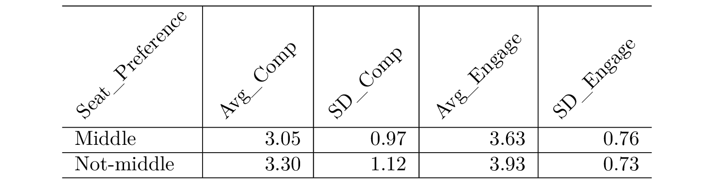

```{r setup, include=FALSE}
knitr::opts_chunk$set(echo = FALSE)
library(tidyverse)
library(broom)
library(papaja)
```

```{r include=FALSE}
# load data
df <- read_csv("../data/seat_clean.csv")
df <- df %>% 
  mutate_at(c("seat_pref", "seat_pref_binary", "gender"), factor) %>% 
  select(seat_pref = seat_pref_binary, comp, gender, engage)
```

### Main question of interest

Seating location in the classroom is commonly linked to grade performance, student engagement, and learning experience (Gowan et al., 2017; Shernoff, et al., 2017). Nevertheless, the question remains whether certain personality dispositions systematically influence where students prefer to sit in a classroom.

#### Methods 

##### Data Collection Methods
To address this gap in the literature, this study aims to explore the relationship between students' self-reported competitiveness and their seating preference. Specifically, this study will survey 69 Master of Data Science students at the University of British Columbia. The main objective of this survey is to explore the question: 
**Does self-reported competitiveness influence where an individual prefers to sit in class?**

##### Survey Study Design
The survey collects data for the following variables: _self-reported competitiveness_, _seating preference_, _gender_ and _student engagement_, the last two, believed to be potential confounds.

The survey can be found [here](./doc/survey.md)

##### Results and Analysis

After gathering the data from the survey, we proceded to analyze it first through [EDA]() and did some engineering to the variables of interest, as in their raw form, one variable could be obtained from more than one question.

**Variables:**
*Competitiveness:* Participants were asked to answer to questions that used a 5-point Likert scale that were later averaged. 

*Gender:* Our researched literature suggests that gender is directly linked to both: where a student prefers to sit and to their competitiveness. 

*Student Engagement:* Our researched literature suggests that students who sit in the back are less engaged in class. Therefore, we measured engagement as a potential confound through 3 questions on the Likert scale and averaged them.




**Response**
*Seating Preference:* Participants were asked to tell us where they usually prefer to sit (front, middle, or back).

**Analysis**
We decided we would want to see how our three variables _competitiveness_, _gender_ and _student engagement_ altered the response _seating preference_ assuming first no interaction between our confounds. We first applied a Additive Regression Model and reported the following findings: 

# MODEL 1 (Additive Model - Ayla)

However, according to our literature (Shernoff, et al., 2017; Buser, T., Niederle, M., & Oosterbeek, H. , et al., 2012) some interaction between our variables is suggested. 
Given this, we decided to use a second Linear Regression Model that would reflect the interaction among variables:

# MODEL 2 (Interaction Model - Bonnie)
MODEL 2 is a three-way interaction logistic regression model. 

This model includes all the two-way and three-way interaction terms of one main predictor(`comp`) and two confounding variables(`engage` and `gender`). This model doesn't fit our data so well since the effects of all these coefficients are not significant. However, it captures some traits that we observed from EDA.

The following data is a summary table of MODEL 2 containing Estimate, LCL(lower bound of a 95% CI), UCL(upper bound of 95% CI) and P-value.

```{r warning=FALSE, results="asis"}
m_model <- glm(seat_pref ~ comp * gender * engage, data = df, family = "binomial")
m_model %>% 
  apa_print() %>% 
  .$table %>% 
  apa_table(caption = "Multiplicative regression model", escape = FALSE)
```

Here are the interpretation of the each coefficients:

`comp`: for every one unit increases of competitiveness, the odds of sitting in the middle(versus not middle) increases by 0.047 times. The main effect of `comp` is not significant (p-value = 0.198 and 95% confidence interval = [-7.719, 1.603]).

`engage`: for every one unit increases of engagement, the odds of sitting in the middle(versus not middle) increases by 0.132 times. The main effect of `engage` is not significant (p-value = 0.237 and 95% confidence interval = [-5.377, 1.332]).

`genderWoman`: the odds of woman choose to sit in the middle(versus not middle) is 0 time comparing to the men's group. The main effect of `gender` is not significant (p-value = 0.182 and 95% confidence interval = [-39.513, 111.316]).

`comp:engage`: the difference between the odds ratio corresponding to an increase in competitiveness of 1 unit for two engagement homogenous group which differs by 1 unit is 2.220 times the original odds ratio. The effect of the interaction term `comp:engage` is not significant (p-value = 0.351 and 95% confidence interval = [-0.373, 1.968]).

`comp:genderWoman`: the odds of sitting in the middle corresponding to one unit increase of competitiveness among men's group is 0 times the original odds ratio comparing to the same unit increase of competitiveness among women's group. The effect of the interaction term `comp:genderWoman` is not significant (p-value = 0.252 and 95% confidence interval = [-43.872, 11.487]).

`engage:genderWoman`: the odds of sitting in the middle corresponding to one unit increase of engagement among women's group is 0 times comparing to the same unit increase of engagement among men's group. The effect of the interaction term `engage:genderWoman` is not significant (p-value = 0.338 and 95% confidence interval = [-28.345, 9.740]).

`comp:engage:genderWoman`: The effect of the three-way interaction term `comp:engage:genderWoman` is not significant (p-value = 0.252 and 95% confidence interval = [-2.907, 11.084]).

#### Discussion of the Results

Waiting to see the results of the models to write a bit more or to addapt.

#### Discussion of your survey and study Design

Although our results seem to show that there is little to no evidence to say that either gender, engagement, or competitiveness would tell us where an individual would like to sit, it is important to understand that we are working with a very limited data set that represents only students currently enrolled at MDS in UBC.

We also have to understand that _gender_ and _engagement_ might not be the only confound variables of interest of our study although they were the only measured variables.

It has also been found that students first enter a classroom where seats are not assigned and where they know nobody else, they claim a seat, in an expression of being territorial and to create comfort within the new space (Guyot,et al., 1980)

Furthermore, social bonds may also have an impact on where a person chooses to sit. For example, if a student sees an old time friend in the same classroom, they might choose to sit with that person.

We are also not sure what did people have in mind when answering to the question: "Where do you prefer to sit?"; as maybe they read "Where are you currently seating in class?" since they are more familiar to their current seat. 

From observation, eventhough seats were never assigned at MDS, we know that most students have kept a sit in the same place or area for the whole 6 blocks; having never experienced other seat, maybe they believe that is where they prefer to sit. However, this might just be a common territorial behaviour (Gifford, et al., 2017) that was not taken into consideration for this study.

One more thing that we noticed is that participants might just associate this survey to the main classroom where we had classes. So their response might only be valid to this limited scenario.

**Limitations**

The current study is observational and exploratory in nature, as such, we cannot make any _causal_ claims about the survey results. We will make apparent on additional limitations and generalizability of this study.

The survey was only answerd by 64 individuals, and 6 values had to be removed. This caused us to have a very limited dataset. 

### References

Gary W. Guyot, Gary R. Byrd, Richard Caudle (1980) Classroom Seating: An Expression of Situational Territoriality in Humans

Scannell, L., & Gifford, R. (2017). The experienced psychological benefits of place attachment. Journal of Environmental Psychology, 51, 256-269.

Buser, T., Niederle, M., & Oosterbeek, H. (2012). Gender, Competitiveness and Career Choices. National Bureau of Economic Research Working Paper Series, 18576. doi:10.3386/w18576

Bönte, W., Lombardo, S., & Urbig, D. (2017). Economics meets psychology: Experimental and self-reported measures of individual competitiveness. Personality and Individual Differences, 116, 179-185. doi:10.1016/j.paid.2017.04.036

Gowan, A. M., Hanna, P., Greer, D., Busch, J., & Anderson, N. (2017). Learning to program - does it matter where you sit in the lecture theatre? 2017 40th International Convention on Information and Communication Technology, Electronics and Microelectronics (MIPRO). doi:10.23919/mipro.2017.7973500

Karatepe, O. M., & Olugbade, O. A. (2009). The effects of job and personal resources on hotel employees’ work engagement. International Journal of Hospitality Management, 28(4), 504-512. doi:10.1016/j.ijhm.2009.02.003

Shernoff, D. J., Sannella, A. J., Schorr, R. Y., Sanchez-Wall, L., Ruzek, E. A., Sinha, S., & Bressler, D. M. (2017). Separate worlds: The influence of seating location on student engagement, classroom experience, and performance in the large university lecture hall. Journal of Environmental Psychology, 49, 55-64. doi:10.1016/j.jenvp.2016.12.002
